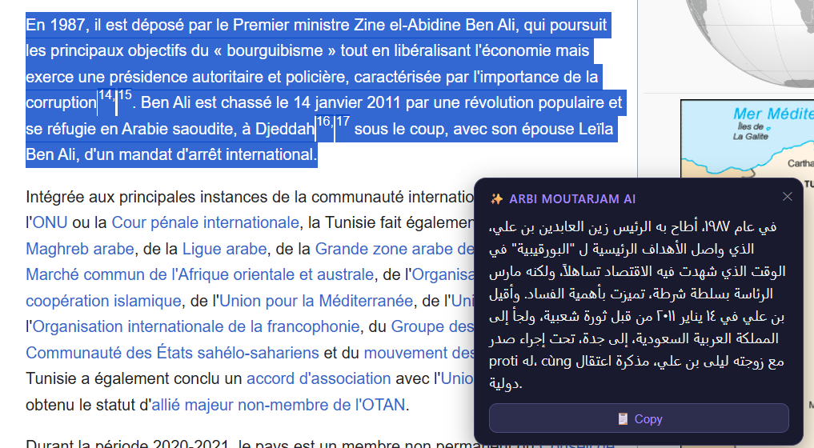

# 🌍 Arbi MoutarjamAI

A Chrome Extension that instantly translates any French or English text to Arabic using AI — just select any text on any webpage!

## ✨ Demo
> Select any text on any webpage → AI translation appears instantly in a popup
> 

## 🚀 Features
- Translate French → Arabic
- Translate English → Arabic
- Works on ANY website
- Clean dark popup UI
- Copy translation with one click
- Powered by LLaMA 3.3 70b via Groq API

## 🛠️ Built With
- JavaScript (Chrome Extension Manifest V3)
- Groq API (LLaMA 3.3 70b)
- HTML/CSS

## ⚙️ Installation
1. Clone this repo
2. Get a free API key from [console.groq.com](https://console.groq.com)
3. Add your key to `content.js`
4. Go to `chrome://extensions`
5. Enable Developer Mode
6. Click "Load unpacked" and select the folder

## 👨‍💻 Author
- 2nd year Software Engineering student
- Built as an AI portfolio project
